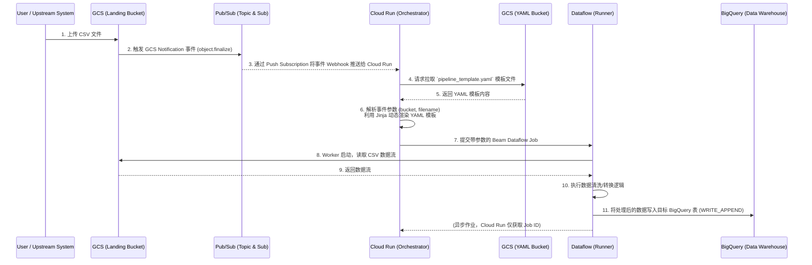

# GCP Event-Driven ETL: GCS to BigQuery via Cloud Run & Beam YAML

## 1. 架构概述 (Architecture Overview)

本项目实现了一个基于 Google Cloud Platform (GCP) 的事件驱动 (Event-Driven) 批处理 ETL 流水线。当用户或上游系统将 CSV 文件上传到 Cloud Storage (GCS) Landing Bucket 时，会自动触发一系列事件，最终通过动态参数化的 Apache Beam YAML 管道，将清洗并转换后的数据加载到 BigQuery (BQ) 中。

此架构的核心亮点在于**极致的组件解耦**：
*   **基础设施即代码 (IaC)**：全量基础组件通过 Terraform 编排。
*   **流水线逻辑配置化**：ETL 逻辑使用 Beam YAML 编写，与代码解耦，以模板形式托管。
*   **通用调度编排**：Cloud Run 作为通用的 "Job Submitter"，仅负责解析事件、获取参数并拉起 Dataflow 作业，不包含任何业务处理逻辑。

---

## 2. 数据流程图 (Data Flow Diagram)

以下是该事件驱动架构的组件交互与数据流转时序图：



---

## 3. 核心组件详细设计 (Component Details)

### 3.1 基础设施组件 (`./infra/`)
本项目使用 **Terraform** 进行 IaC 部署，管理所有 GCP 资源。包含以下核心模块：
*   **Landing Bucket (`landing-bucket`)**: 
    *   **作用**：作为数据湖的入水口，接收原始 CSV 文件。
    *   **交互**：配置 `google_storage_notification`，监听 `OBJECT_FINALIZE` (文件创建/覆盖) 事件，并将事件负载发送至 Pub/Sub Topic。
*   **YAML Bucket (`yaml-bucket`)**: 
    *   **作用**：存储 Dataflow 的 Beam YAML 模板文件 (`pipeline_template.yaml`)。
    *   **交互**：仅作为只读模板库，供 Cloud Run 读取。当流水线逻辑需要修改时，只需更新此 Bucket 中的 YAML 文件，无需重新部署 Cloud Run 服务。
*   **Pub/Sub Topic & Push Subscription**: 
    *   **作用**：异步事件总线。GCS Notification 将事件发往 Topic，Subscription 采用 `Push` 模式，将事件以 HTTP POST 请求的形式投递给 Cloud Run 服务的暴露端点。
    *   **配置要点**：Push Subscription 的 `ack_deadline_seconds` 需要适当延长 (例如 60 秒)，因为 Cloud Run 启动并提交 Dataflow Job（构建执行图）可能需要几秒到十几秒，避免因超时引发的重复投递。
*   **BigQuery Dataset & Table (`target_dataset`)**: 
    *   **作用**：数据仓库的终点，接收清洗后的结构化数据。

### 3.2 编排与调度服务 (`./cloudrun/`)
*   **技术栈**：Python, FastAPI, Uvicorn, Apache Beam SDK, Jinja2.
*   **核心功能**：作为一个轻量级的 Webhook 接收器和 Dataflow 启动器。
*   **数据处理流程**：
    1.  **事件解析**：FastAPI 暴露 `/pubsub` 端点，接收 Push Subscription 发来的 Base64 编码的 Pub/Sub Message。解码后解析出触发事件的 `bucket` 和 `name` (CSV 文件名)。
    2.  **动态路由**：根据文件名（如日期后缀、业务前缀），动态决定目标 BigQuery 表名 (`target_table`)。
    3.  **模板获取与渲染**：通过 Google Cloud Storage API 从 YAML Bucket 下载 `pipeline_template.yaml`。使用 `Jinja2` 模板引擎，将 `input_csv_path` (拼接自 bucket 和 name) 以及 `target_bq_table` 动态注入到 YAML 字符串中。
    4.  **任务提交**：构造 `PipelineOptions` (指定 Runner、Region、Subnetwork、Service Account 等)，并使用 `yaml_transform.YamlTransform` 将渲染后的 YAML 提交给 Dataflow 服务。
*   **交互说明**：Cloud Run 的职责到成功获取 `Job ID` 即结束，它不等待 Dataflow 跑完（异步非阻塞），从而节省计算资源并快速返回 `200 OK` 给 Pub/Sub 以 ACK 消息。

### 3.3 数据处理流水线 (`./dataflow/`)
*   **技术栈**：Apache Beam YAML API
*   **核心功能**：定义实际的数据提取 (Extract)、转换 (Transform) 和加载 (Load) 逻辑。
*   **参数化设计**：YAML 文件中预留 Jinja 占位符。
    ```yaml
    # pipeline_template.yaml 示例
    type: chain
    transforms:
      - type: ReadFromCsv
        name: ReadLandingCSV
        config:
          path: "{{ input_csv_path }}"
      - type: WriteToBigQuery
        name: WriteToBQ
        config:
          table: "{{ target_bq_table }}"
          create_disposition: CREATE_IF_NEEDED
          write_disposition: WRITE_APPEND
    ```
*   **Cloud Build 集成**：目录内包含 `cloudbuild.yaml`，用于在 CI/CD 阶段将修改后的 YAML 文件自动同步 (gsutil cp) 到 GCS YAML Bucket。

### 3.4 模拟数据输入 (`./csv/`)
*   **作用**：包含用于本地测试和 E2E 集成测试的 CSV 样例文件。直接上传该目录下的文件到 Landing Bucket 即可完整触发整个事件驱动链路。

---

## 4. 权限隔离与安全性 (IAM & Security)
为保证生产环境的最小权限原则 (Least Privilege)，架构中需要严格的角色划分，我们将在 Terraform (`./infra`) 中明确创建和配置以下 Service Accounts (SA)：

1.  **GCS 专属服务账号 (Google-managed Storage SA)**：
    *   **命名示例**: `service-[PROJECT_NUMBER]@gs-project-accounts.iam.gserviceaccount.com` (系统自动生成)
    *   **权限需求**: 需具备 `roles/pubsub.publisher` 权限，以允许 GCS 桶在发生事件时向指定的 Pub/Sub Topic 发送 Notification。
2.  **Pub/Sub Push 调用身份 (`pubsub-invoker-sa-poc`)**：
    *   **命名设计**: `pubsub-invoker-sa-poc@[PROJECT_ID].iam.gserviceaccount.com`
    *   **权限需求**: 需关联到 Push Subscription，具备 `roles/run.invoker` 权限，以便合法触发 Cloud Run 的 HTTP Webhook。
3.  **Cloud Run 编排服务账号 (`cloudrun-orchestrator-sa-poc`)**：
    *   **命名设计**: `cloudrun-orchestrator-sa-poc@[PROJECT_ID].iam.gserviceaccount.com`
    *   **权限需求**:
        *   读取 YAML Bucket 以获取流水线模板 (`roles/storage.objectViewer`)
        *   作为 Job Submitter 向 Dataflow 提交作业 (`roles/dataflow.developer`)
        *   必须能够扮演 (ActAs) 下方的 Dataflow Worker 账号，以拉起计算资源 (`roles/iam.serviceAccountUser` 绑定到 `dataflow-worker-sa-poc` 身上)
4.  **Dataflow Worker 计算服务账号 (`dataflow-worker-sa-poc`)**：
    *   **命名设计**: `dataflow-worker-sa-poc@[PROJECT_ID].iam.gserviceaccount.com`
    *   **权限需求**: 这是 Dataflow Compute Engine 虚拟机集群实际运行时的身份，专注于数据面：
        *   读取 Landing Bucket 中的 CSV 数据 (`roles/storage.objectViewer`)
        *   写入数据和 Job 状态到 BigQuery (`roles/bigquery.dataEditor`, `roles/bigquery.jobUser`)
        *   写入 Dataflow 临时/暂存 Bucket (`roles/storage.objectAdmin`, 或者是特定的 temp bucket 访问权限)

## 5. 扩展性与未来演进 (Extensibility)
*   **动态 Schema 推断**：Beam YAML 的 `ReadFromCsv` 支持自动推断 Schema 并直接建表，非常适合结构易变的数据接入。
*   **多链路分发**：可在 Cloud Run 收到事件后，基于不同的文件名正则匹配，拉取不同的 YAML 模板，实现一套编排引擎支撑多个业务线 ETL。
