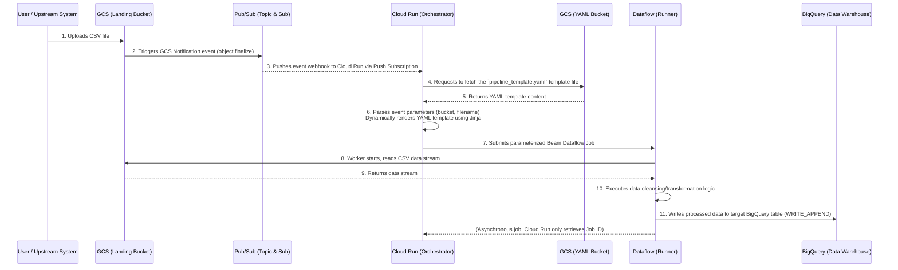

# GCP Event-Driven ETL: GCS to BigQuery via Cloud Run & Beam YAML

## 1. Architecture Overview

This project implements an event-driven batch ETL pipeline based on Google Cloud Platform (GCP). When a user or an upstream system uploads a CSV file to the Cloud Storage (GCS) Landing Bucket, a series of events are automatically triggered, eventually loading the cleaned and transformed data into BigQuery (BQ) via a dynamically parameterized Apache Beam YAML pipeline.

The core highlight of this architecture is its **extreme component decoupling**:
*   **Infrastructure as Code (IaC)**: All foundational components are orchestrated via Terraform.
*   **Configuration-driven Pipeline Logic**: ETL logic is written using Beam YAML, decoupled from the codebase, and hosted as a template.
*   **Generic Scheduling and Orchestration**: Cloud Run acts as a generic "Job Submitter", solely responsible for parsing events, fetching parameters, and launching Dataflow jobs, without containing any business processing logic.

---

## 2. Data Flow Diagram

The following sequence diagram illustrates the component interactions and data flow within this event-driven architecture:


```mermaid
sequenceDiagram
    participant User as User / Upstream System
    participant LandingBucket as GCS (Landing Bucket)
    participant PubSub as Pub/Sub (Topic & Sub)
    participant CloudRun as Cloud Run (Orchestrator)
    participant YAMLBucket as GCS (YAML Bucket)
    participant Dataflow as Dataflow (Runner)
    participant BQ as BigQuery (Data Warehouse)

    User->>LandingBucket: 1. Uploads CSV file
    LandingBucket->>PubSub: 2. Triggers GCS Notification event (object.finalize)
    PubSub-->>CloudRun: 3. Pushes event webhook to Cloud Run via Push Subscription
    CloudRun->>YAMLBucket: 4. Requests to fetch the `pipeline_template.yaml` template file
    YAMLBucket-->>CloudRun: 5. Returns YAML template content
    CloudRun->>CloudRun: 6. Parses event parameters (bucket, filename)<br/>Dynamically renders YAML template using Jinja
    CloudRun->>Dataflow: 7. Submits parameterized Beam Dataflow Job
    Dataflow->>LandingBucket: 8. Worker starts, reads CSV data stream
    LandingBucket-->>Dataflow: 9. Returns data stream
    Dataflow->>Dataflow: 10. Executes data cleansing/transformation logic
    Dataflow->>BQ: 11. Writes processed data to target BigQuery table (WRITE_APPEND)
    Dataflow-->>CloudRun: (Asynchronous job, Cloud Run only retrieves Job ID)
```

---

## 3. Core Component Detailed Design

### 3.1 Infrastructure Components (`./infra/`)
This project uses **Terraform** for IaC deployment to manage all GCP resources. It includes the following core modules:
*   **Landing Bucket (`landing-bucket`)**: 
    *   **Role**: Acts as the data lake intake, receiving raw CSV files.
    *   **Interaction**: Configures `google_storage_notification` to listen for `OBJECT_FINALIZE` (file creation/overwrite) events and sends the event payload to a Pub/Sub Topic.
*   **YAML Bucket (`yaml-bucket`)**: 
    *   **Role**: Stores the Beam YAML template file (`pipeline_template.yaml`) for Dataflow.
    *   **Interaction**: Serves solely as a read-only template repository for Cloud Run. When pipeline logic needs modification, simply update the YAML file in this bucket without redeploying the Cloud Run service.
*   **Pub/Sub Topic & Push Subscription**: 
    *   **Role**: Asynchronous event bus. GCS Notification sends events to the Topic, and the Subscription uses `Push` mode to deliver events as HTTP POST requests to the exposed endpoint of the Cloud Run service.
    *   **Configuration Key Points**: The `ack_deadline_seconds` of the Push Subscription needs to be appropriately extended (e.g., 60 seconds) because Cloud Run starting up and submitting the Dataflow Job (building the execution graph) might take several seconds to over ten seconds, avoiding duplicate deliveries caused by timeouts.
*   **BigQuery Dataset & Table (`target_dataset`)**: 
    *   **Role**: The destination of the data warehouse, receiving cleaned structured data.

### 3.2 Orchestration and Scheduling Service (`./cloudrun/`)
*   **Tech Stack**: Python, FastAPI, Uvicorn, Apache Beam SDK, Jinja2.
*   **Core Functionality**: Acts as a lightweight Webhook receiver and Dataflow launcher.
*   **Data Processing Flow**:
    1.  **Event Parsing**: FastAPI exposes the `/pubsub` endpoint to receive Base64-encoded Pub/Sub Messages sent from the Push Subscription. After decoding, it parses the triggering event's `bucket` and `name` (CSV filename).
    2.  **Dynamic Routing**: Dynamically determines the target BigQuery table name (`target_table`) based on the filename (e.g., date suffix, business prefix).
    3.  **Template Retrieval and Rendering**: Downloads `pipeline_template.yaml` from the YAML Bucket via the Google Cloud Storage API. Uses the `Jinja2` template engine to dynamically inject `input_csv_path` (concatenated from bucket and name) and `target_bq_table` into the YAML string.
    4.  **Job Submission**: Constructs `PipelineOptions` (specifying Runner, Region, Subnetwork, Service Account, etc.) and uses `yaml_transform.YamlTransform` to submit the rendered YAML to the Dataflow service.
*   **Interaction Details**: Cloud Run's responsibility ends upon successfully retrieving the `Job ID`. It does not wait for Dataflow to finish (asynchronous non-blocking), thereby saving compute resources and quickly returning a `200 OK` to Pub/Sub to ACK the message.

### 3.3 Data Processing Pipeline (`./dataflow/`)
*   **Tech Stack**: Apache Beam YAML API
*   **Core Functionality**: Defines the actual data Extract, Transform, and Load (ETL) logic.
*   **Parameterized Design**: Jinja placeholders are reserved in the YAML file.
    ```yaml
    # pipeline_template.yaml example
    type: chain
    transforms:
      - type: ReadFromCsv
        config:
          path: "{{ input_csv_path }}"
      - type: WriteToBigQuery
        config:
          table: "{{ target_bq_table }}"
          create_disposition: CREATE_IF_NEEDED
          write_disposition: WRITE_APPEND
    ```
*   **Cloud Build Integration**: The directory contains `cloudbuild.yaml`, used during the CI/CD phase to automatically synchronize (gsutil cp) the modified YAML file to the GCS YAML Bucket.

### 3.4 Mock Data Input (`./csv/`)
*   **Role**: Contains CSV sample files for local testing and E2E integration testing. Directly uploading files from this directory to the Landing Bucket will fully trigger the entire event-driven chain.

---

## 4. Privilege Isolation and Security (IAM & Security)
To ensure the Principle of Least Privilege in the production environment, strict role segregation is required within the architecture. We will explicitly create and configure the following Service Accounts (SAs) in Terraform (`./infra`):

1.  **GCS Dedicated Service Account (Google-managed Storage SA)**:
    *   **Naming Example**: `service-[PROJECT_NUMBER]@gs-project-accounts.iam.gserviceaccount.com` (System automatically generated)
    *   **Privilege Requirement**: Needs `roles/pubsub.publisher` permission to allow the GCS bucket to send Notifications to the specified Pub/Sub Topic when events occur.
2.  **Pub/Sub Push Invoker Identity (`pubsub-invoker-sa-poc`)**:
    *   **Naming Design**: `pubsub-invoker-sa-poc@[PROJECT_ID].iam.gserviceaccount.com`
    *   **Privilege Requirement**: Needs to be associated with the Push Subscription and have the `roles/run.invoker` permission to legally trigger the Cloud Run HTTP Webhook.
3.  **Cloud Run Orchestration Service Account (`cloudrun-orchestrator-sa-poc`)**:
    *   **Naming Design**: `cloudrun-orchestrator-sa-poc@[PROJECT_ID].iam.gserviceaccount.com`
    *   **Privilege Requirement**:
        *   Read the YAML Bucket to fetch pipeline templates (`roles/storage.objectViewer`)
        *   Act as a Job Submitter to submit jobs to Dataflow (`roles/dataflow.developer`)
        *   Must be able to impersonate (ActAs) the Dataflow Worker account below to provision compute resources (`roles/iam.serviceAccountUser` bound to `dataflow-worker-sa-poc`)
4.  **Dataflow Worker Compute Service Account (`dataflow-worker-sa-poc`)**:
    *   **Naming Design**: `dataflow-worker-sa-poc@[PROJECT_ID].iam.gserviceaccount.com`
    *   **Privilege Requirement**: This is the actual runtime identity of the Dataflow Compute Engine virtual machine cluster, focused on the data plane:
        *   Read CSV data from the Landing Bucket (`roles/storage.objectViewer`)
        *   Write data and Job status to BigQuery (`roles/bigquery.dataEditor`, `roles/bigquery.jobUser`)
        *   Write to the Dataflow temporary/staging Bucket (`roles/storage.objectAdmin`, or specific temp bucket access permissions)

## 5. Extensibility and Future Evolution (Extensibility)
*   **Dynamic Schema Inference**: Beam YAML's `ReadFromCsv` supports automatic Schema inference and direct table creation, making it highly suitable for data ingestion with volatile structures.
*   **Multi-chain Routing**: After receiving events, Cloud Run can fetch different YAML templates based on various filename regex matches, enabling a single orchestration engine to support ETL for multiple business lines.
