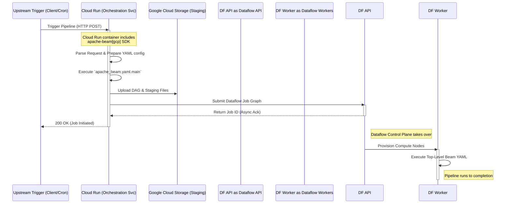

# Design Document: Cloud Run Orchestration Service for Beam YAML

## 1. Background
In our modern data platform architecture, we are adopting **Apache Beam YAML** to define Dataflow pipelines declaratively. To automate and orchestrate these pipelines dynamically, we are introducing a **Cloud Run Orchestration Service**. This service will act as the trigger mechanism, receiving upstream events (e.g., HTTP requests, Pub/Sub messages) and launching the corresponding Dataflow jobs directly.

## 2. Core Concepts: Sub-YAML vs. Top-Level YAML

Before designing the orchestration mechanism, it is crucial to understand the two paradigms of Beam YAML:

### 2.1 Sub-YAML (Embedded Transform)
- **Usage:** Embedded inside a traditional Python `beam.Pipeline` using `yaml_transform.YamlTransform(yaml_str)`.
- **Scope:** Acts merely as a `PTransform`. It only defines data processing steps (e.g., Read -> Map -> Write) without any global execution context.
- **Limitation:** It cannot contain pipeline-level configurations (`options:`, `runner:`, etc.).

### 2.2 Top-Level YAML (Standalone Pipeline)
- **Usage:** A complete pipeline specification parsed directly by `apache_beam.yaml.main`.
- **Scope:** Defines the entire lifecycle and execution environment, including `pipeline:`, `options:`, and runner configurations.
- **Limitation:** Cannot be executed via `YamlTransform(yaml_str)` directly within a Python script.

Since our orchestrator needs to trigger fully self-contained jobs based on complete configuration files, we are dealing exclusively with **Top-Level YAML**.

## 3. Technical Evaluation: Triggering Top-Level YAML from Cloud Run

To launch a Top-Level YAML job from Cloud Run, we evaluated two primary approaches:

### Option A: Dataflow Flex Template Integration (Blocked)
- **Concept:** Package the YAML into a Flex Template and use the lightweight Google Cloud SDK to trigger it.
- **Status:** **Blocked.** Due to unresolved corporate environment issues with Flex Templates (pending Google Support), this approach is currently unviable.

### Option B: Direct Execution via Beam SDK (Chosen)
- **Concept:** The Cloud Run image includes the full `apache-beam[gcp]` SDK. When triggered, the service dynamically executes the Top-Level YAML using `apache_beam.yaml.main` (either programmatically or via subprocess).
- **Pros:** 
  - **No Flex Template Dependency:** Bypasses the corporate issue entirely. Uses the standard Beam DataflowRunner job submission process.
  - **Maximum Flexibility:** Allows dynamic construction or manipulation of the YAML string right before submission.
- **Cons:**
  - **Heavier Image:** The Cloud Run container must package the `apache-beam` library.
  - **Higher Memory/CPU Usage at Trigger Time:** Building the DAG and staging files to GCS happens inside the Cloud Run instance. Cloud Run memory must be sized appropriately (e.g., 1GB - 2GB) to avoid OOM during the DAG parsing phase.

## 4. Architecture Decision

We have explicitly chosen **Option B (Direct Execution via Beam SDK)**. 

The Cloud Run Orchestration Service will act as a Beam client. Upon receiving a trigger, it will invoke the Apache Beam YAML parser (`apache_beam.yaml.main`), which will compile the job graph, upload staging artifacts to GCS, and submit the pipeline to the Dataflow control plane. Since the DataflowRunner operates asynchronously, Cloud Run will quickly receive a Job ID and return a 200 OK to the caller without waiting for the job to finish.

## 5. System Flow (Mermaid)

The following sequence diagram illustrates the chosen architecture (Option B):

